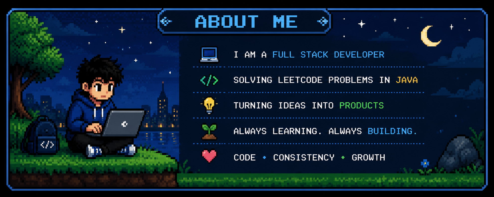
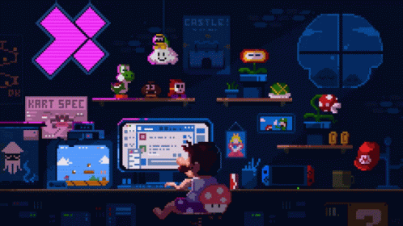

  

  

  

<h1 align="center">Tech Stack</h1>

<h3 align="center">💻 Languages</h3>

  

<h3 align="center">🌐 Development</h3>

  

<h3 align="center">🗄️ Database & Tools</h3>

  

<h2 align="center">Hacktoberfest'25</h2>

  

