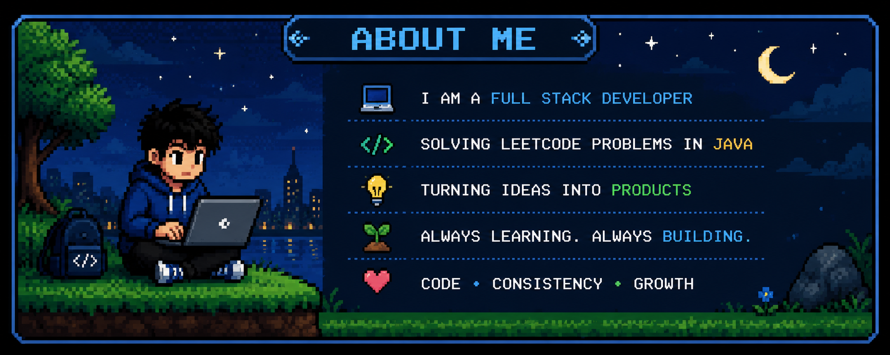
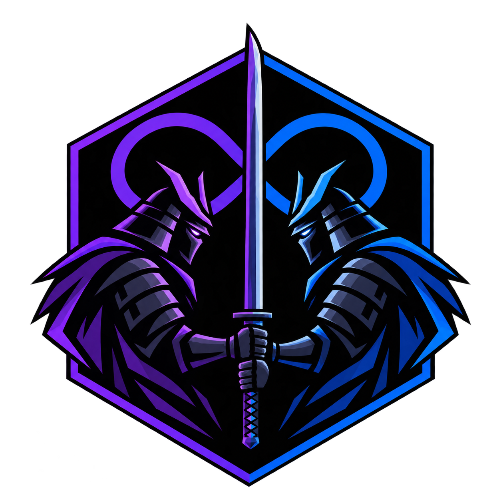
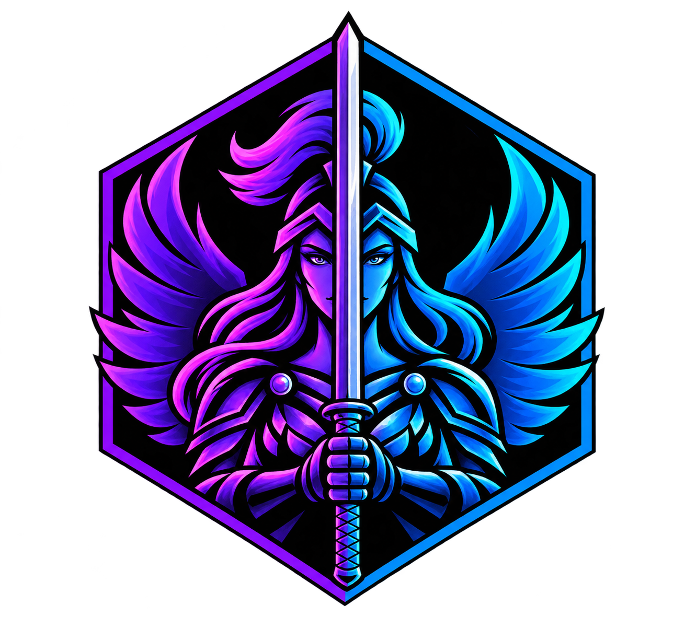
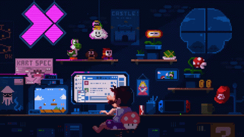

  

  

  

<h1 align="center">Projects</h1>

<h3>RoninP2P</h3>

A high-performance peer-to-peer file transfer system built with WebRTC,
designed for transferring multi-gigabyte files directly between peers.

<strong>Tech:</strong> React · Node.js · WebRTC · Socket.IO · Tailwind CSS

<a href="https://github.com/vasanth642/RoninP2P">View Repository →</a>

 

 

<h3>ValkyrieAlloc</h3>

A Zerops-native sub-millisecond in-memory allocation gate designed to handle
high-concurrency flash-sale traffic with atomic Valkey Lua evaluations and
asynchronous PostgreSQL persistence.

<strong>Tech:</strong> Valkey · Lua · PostgreSQL · React · Tailwind CSS · Zerops 

<a href="https://github.com/vasanth642/Valkyrie-Alloc">View Repository →</a>

 

<h1 align="center">Tech Stack</h1>

<h2 align="center">Languages</h2>

  

<h2 align="center">Development</h2>

  

<h2 align="center">Database & Tools</h2>

  

 

  

 

<h1 align="center">🤝 Connect With Me</h1>

  

 

<h1 align="center">Open Source Contributions</h1>

<h2 align="center">🏆 Hacktoberfest'25</h2>

  

